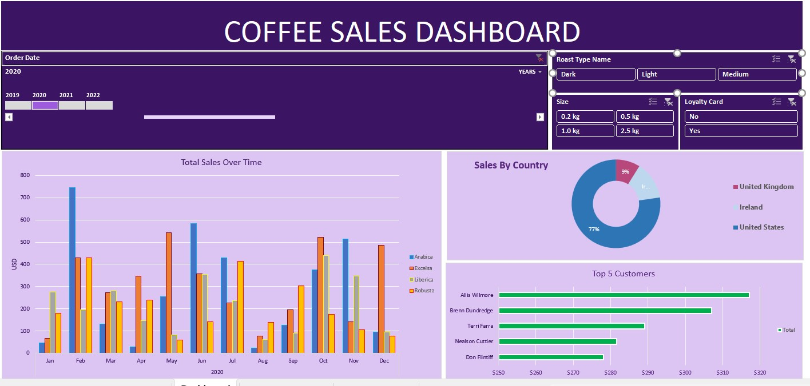

# ☕ Coffee Sales Dashboard Analysis

## 📌 Project Overview

This Coffee Sales Dashboard project showcases my expertise in building business intelligence solutions using **Power BI** to provide real-time insights into sales performance, customer behavior, and product segmentation across **multiple years, regions, and roast types**.

> As visualized in the image above, the dashboard is built to give **stakeholders, executives, and marketing teams** a clear and interactive view of the company’s performance metrics — broken down by **time, geography, product types, and customer segments**.

---

## 💼 Why This Project Matters to Employers

- **Real-Time Business Monitoring**: Designed to give decision-makers a holistic overview of sales trends.
- **Customer-Centric Insights**: Identifies **Top 5 high-value customers** and their contributions to revenue.
- **Product Intelligence**: Tracks performance of four coffee types — *Arabica, Excelsa, Liberica, and Robusta* — helping in SKU optimization and inventory planning.
- **Geographic Targeting**: A clear country-based breakdown (US, UK, Ireland) helps refine regional strategy and logistics.
- **Marketing Analytics**: Integration of loyalty card filters and packaging size shows potential areas for upselling and retention strategy.

---

## 📊 Dashboard Features

- 📆 **Order Date Slicer** for year-over-year comparisons  
- ☕ **Roast Type, Size, Loyalty Filters** for segment drilldowns  
- 📈 **Total Sales Over Time** (monthly breakdown)  
- 🌍 **Sales by Country** – Pie chart view of market share  
- 🧑‍💼 **Top 5 Customers** – Bar chart highlighting high-value accounts

---

## 🧠 Key Business Insights

- The **United States** commands over **75% of total sales**, positioning it as the brand’s dominant market.
- **Arabica and Robusta** are top performers in revenue across all months.
- **February, May, and October** show peak sales, signaling promotional opportunities.
- **Allis Wilmore** and **Brenn Dundredge** are top customers, representing consistent purchase behavior valuable for loyalty programs.

---

## 🛠 Tools & Technologies

- **Power BI Desktop** – Dashboard design, DAX, and storytelling
- **Power Query** – ETL and data prep
- **Excel** – Base data formatting
- **Dynamic Filters & Slicers** – For user-driven exploration

---

## ✅ Skills Demonstrated

- 🧩 Data Modeling & Relationship Mapping  
- 📉 Time-Series Sales Analysis  
- 🔍 Customer Segmentation  
- 🎯 Performance Benchmarking  
- 🧼 Data Cleaning & Transformation  
- 📣 Insight Communication & Reporting

---

## 👨‍💻 About Me

I'm a **Data Analyst & Data Scientist** passionate about using analytics to improve business outcomes. This dashboard demonstrates my ability to not only design compelling visuals but to generate **insights that drive real decisions**.

📬 **Let’s connect**:
- **LinkedIn**: [Tosin Bello](https://www.linkedin.com/in/tosinbellofin)
- **Email**: toshineb@email.com

---

## ⭐ Found this useful? Star the repo and follow for more analytics projects.
